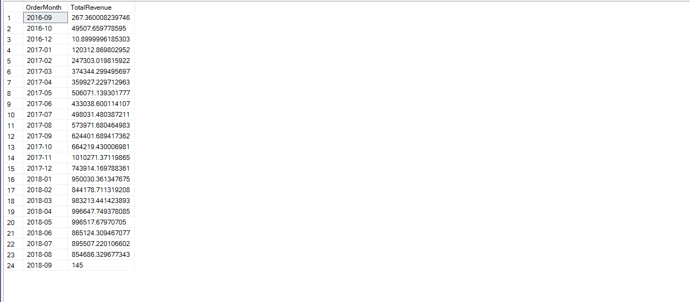
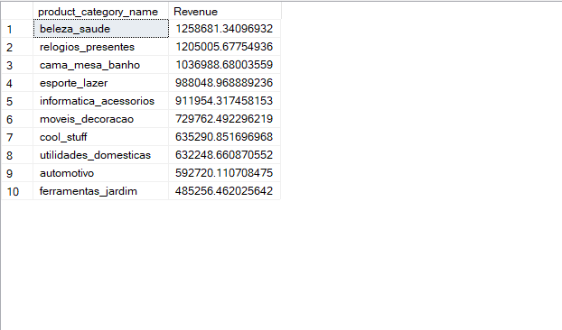
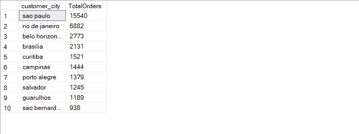

# E-commerce Business Insights Using SQL

## Project Overview
This project analyzes an e-commerce dataset using SQL to uncover key business insights related to revenue trends, customer behavior, and product performance.

## Tools Used
- SQL Server
- SQL Server Management Studio

## Key Analysis

### 1 Monthly Revenue Trend
Analyzed revenue growth across months to identify business growth patterns.

### 2 Top Product Categories
Identified product categories generating the highest revenue.

### 3 Customer Distribution
Analyzed cities with the highest number of orders.

### 4 Average Order Value
Calculated average revenue generated per order.

### 5 Payment Method Analysis
Identified the most popular payment methods used by customers.

### 6 Customer Lifetime Value
Calculated total revenue generated per customer.

### 7 Repeat Customer Analysis
Measured customer retention by identifying repeat customers.

## Key Insights
- Revenue shows steady growth over time.
- Bedroom furniture category generated the highest revenue.
- Belo Horizonte and Brasília are top cities by order volume.
- Average order value is approximately $137.
- Credit cards are the most commonly used payment method.
- ## Project Results

### Monthly Revenue Trend

### Top Product Categories

### Top Customer Cities

### Payment Method Analysis

